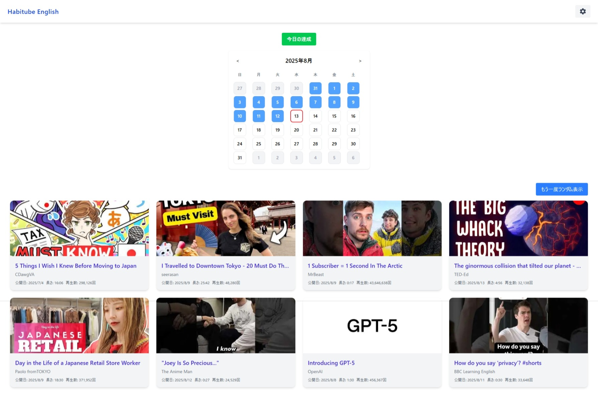
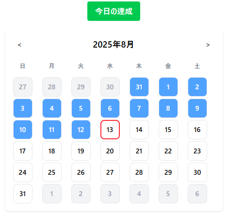
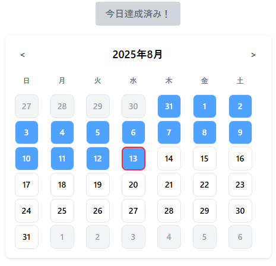
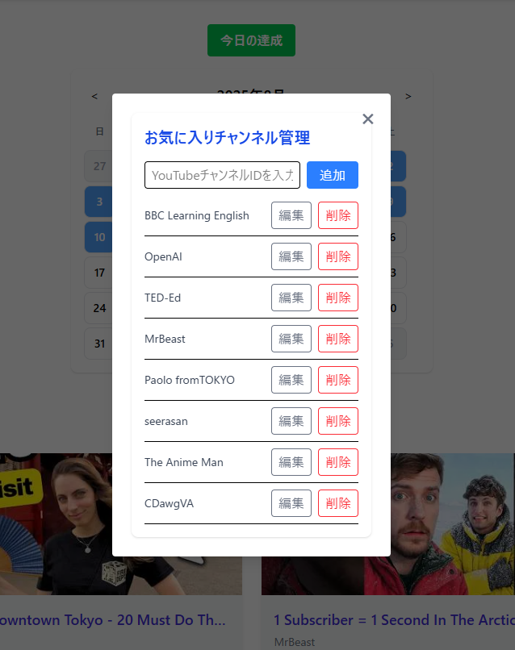

# Habitube English

## 英語学習の継続をサポートする、英語 YouTube 動画視聴 × 達成カレンダーの Web アプリ

YouTube の英語学習チャンネルの最新動画を一覧表示し、視聴記録をカレンダーで可視化することで、毎日の学習習慣を楽しく継続できるサービスです。

---

## 技術スタック

| カテゴリ          | 技術・サービス                                                  |
| ----------------- | ------------------------------------------------------------------------------ |
| フロントエンド    | Next.js v15.4.5 / React v19.1.0 / TypeScript v5 / Tailwind CSS v4 |
| バックエンド      | Next.js API Routes v15.4.5 / TypeScript v5                                     |
| データベース      | SQLite v3.46.0                                                                         |
| ORM               | Prisma v6.13.0                                                                 |
| 開発支援          | GitHub Copilot                                                                 |
| 外部サービス・API | YouTube Data API v3                                                            |

---

## 主な機能

### 学習の達成状況を一目で確認できるカレンダー機能

- 日々の学習の達成をボタンクリックで簡単に記録
- 月ごとの達成状況をカレンダーで可視化

  
  

### お気に入りチャンネルの最新動画リスト

- お気に入り登録したチャンネルの最新動画を自動で取得
- タイトル、サムネイル、チャンネル名を表示
- クリックすると YouTube 動画が新規タブで再生

### お気に入りのチャンネルの管理

- お気に入りのチャンネルを自由に追加・削除
- チャンネルリストの編集はモーダル UI で操作

